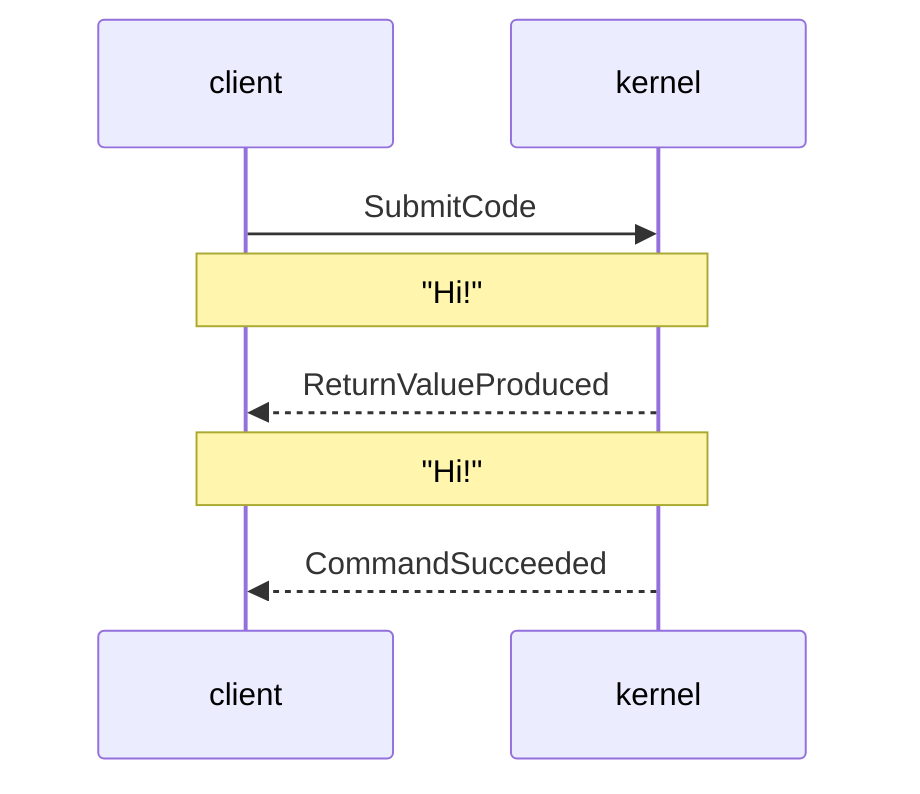
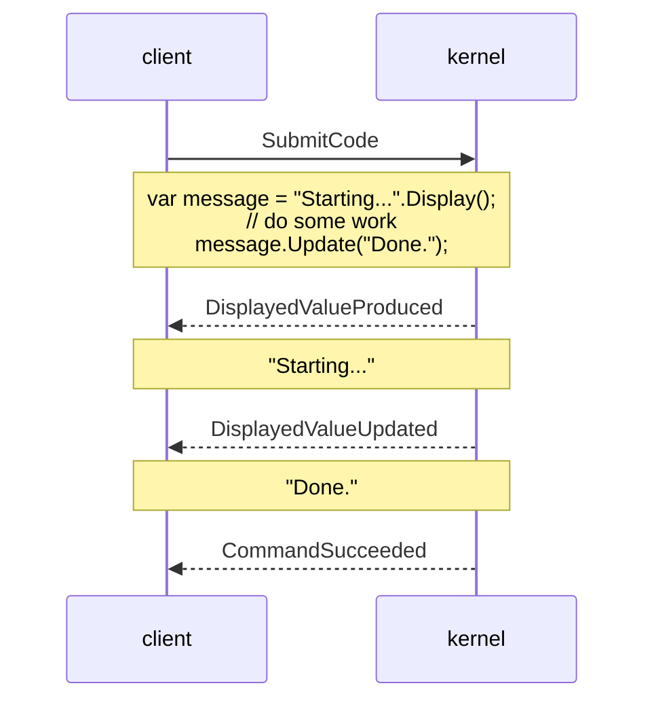

# .NET Interactive Architectural Overview 

The kernel concept in .NET Interactive is a component that accepts commands and produces outputs. The commands are typically blocks of code, and the outputs are events that describe the results and effects of that code, including executing code and providing language services such as completions and diagnostics. The `Kernel` class represents this core abstraction.

A kernel doesn't have to run in its own process. The default `dotnet-interactive` configuration runs several kernels in one process, enabling scenarios such as language-switching and .NET variable sharing by reference between C#, F#, and PowerShell. But one or more kernels can also run out-of-process, which will be transparent from the point of view of someone using it. The `Kernel` APIs are message-based and provide the same API for all kernels whether they are in-process, out-of-process, or running on remote machines.

The `dotnet-interactive` tool also provides a number of protocols, including the [Jupyter message protocol](https://jupyter-client.readthedocs.io/en/stable/messaging.html) and a JSON-based message protocol that can be accessed over standard I/O, named pipes, or HTTP. These multiple protocols allow the core set of capabilities to be fairly portable.


## Commands and events

All communication with a kernel as well as between out-of-process kernels takes place through a sequence of messages. There are two kinds of messages: commands and events. The typical sequence starts with a command being sent to a kernel, which will reply with one or more events. The terminating event will always be either `CommandSucceeded` (if everything completed successfully) or `CommandFailed` (if there was a compilation error or runtime exception). This terminating event will often be preceded by one or more other events describing the results of the command as it's being processed. 

The most common command is `SubmitCode`, which is used when a block of code is sent to the kernel for execution. A code submission is created each time you run a notebook cell. 



It's also possible for a single submission to generate multiple commands.



## Nested Kernels

In the standard configuration, .NET Interactive uses multiple, nested kernels. These kernels share a common set of interfaces which allow them to be composed into different kinds of pipelines. This is the basis for supporting multiple languages, among other features. A user of a .NET Interactive-backed notebook can specify the language for a code submission by prefixing a block of code with a [magic command](magic-commands.md) such as `#!csharp`, `#!fsharp`, or `#!pwsh`, or by using the cell kernel selector in the lower right corner of a Polyglot Notebooks notebook cell.


The language-selection magic commands will even allow you to submit code for multiple languages in a single notebook cell. Once again, the submission will be split into several commands, just like in the `#!time` example above. Consider this submission:

```csharp
#!csharp
Console.WriteLine("Hello from C#!");
#!fsharp
"Hello from F#!" |> Console.WriteLine
```

Even though this will initially be sent as a single `SubmitCode` command, it will be split into two different `SubmitCode` commands, each targeting the appropriate subcommand.

The work of routing these commands is done by the `CompositeKernel` class, which wraps a number of subkernels. Here are some examples: 


Note that while the composite configuration is the default when using the `dotnet-interactive` tool via Polyglot Notebooks or Jupyter, the .NET Interactive [NuGet packages](https://www.nuget.org/packages?q=microsoft.dotnet.interactive) let you create other configurations. For example, you might provide a single-language embedded scripting experience using the C# kernel by itself, or you might provide multiple F# kernels each preconfigured to run code on a different processor.
