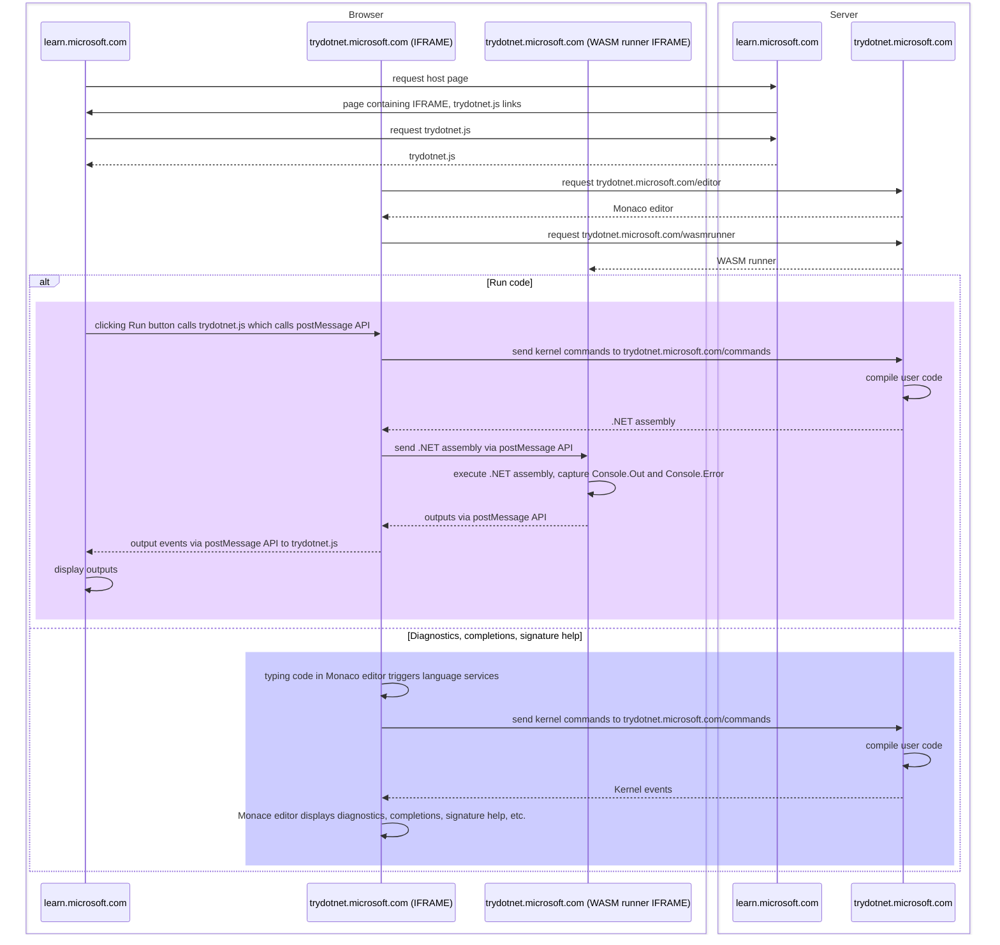

The `CSharpProjectKernel` is the .NET Interactive backend for Try .NET.

## Try .NET / Microsoft Learn flow

The following diagram shows the interaction between the Try .NET service (trydotnet.microsoft.com) and a host page (learn.microsoft.com).

