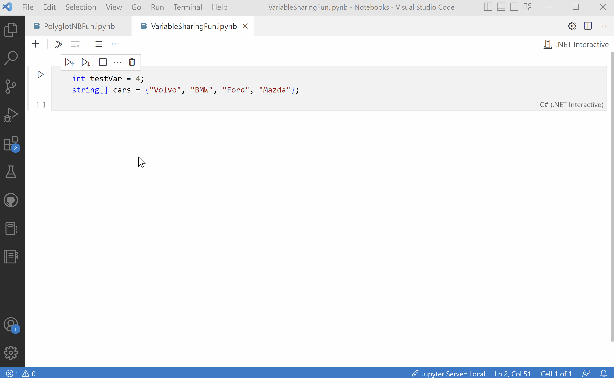

This extension is currently **_in preview_**.
_The Visual Studio Code notebook support that this extension uses is also in preview and design is ongoing, so the extension might not work._
---

# Polyglot Notebooks

With the Polyglot Notebooks extension, you can use multiple languages in the same notebook and share variables between them. No more installing different Jupyter kernels, using wrapper libraries, or different tools to get the best language server support for the language of your choice. Always use the best language for the job and seamlessly transition between different states of your workflow, all within one notebook. 

## Languages Supported

- C#
- F# 
- PowerShell
- JavaScript
- SQL
- KQL (Kusto Query Language)
- HTML*
- Mermaid*

*Variable sharing not available

## Features

- Connect to and query from Microsoft SQL Server databases and Kusto clusters
- Run and execute code for all 8 featured languages
- Language server support such as completions, syntax highlighting, and signature help for each language
- Variable sharing between languages
- Variable Explorer to check value and state of variables 
- Create detailed diagrams and visualizations using [Mermaid](https://mermaid-js.github.io/mermaid/#/)
- Integration with your favorite VS Code extensions such as [VIM](https://marketplace.visualstudio.com/items?itemName=vscodevim.vim) and [GitLens](https://marketplace.visualstudio.com/items?itemName=eamodio.gitlens)
- Notebook-friendly diffing tool that makes it easy to visually compare inputs, outputs, and metadata
- Quick navigation via Table of Contents (Outline)
- Customizable notebook layout

## Getting Started

1.  Install the latest [Visual Studio Code](https://code.visualstudio.com/).

2.  Install the latest [.NET 6 SDK](https://dotnet.microsoft.com/download/dotnet/6.0). 

3.  Install the Polyglot Notebooks extension from the [marketplace](https://marketplace.visualstudio.com/items?itemName=ms-dotnettools.dotnet-interactive-vscode).

## Creating Notebooks

To create a new polyglot notebook, open the Command Palette(`Ctrl+Shift+P`), and select **Polyglot Notebook: Create new blank notebook**. You can also create a new notebook with `Ctrl+Shift+Alt+N` key combination.

## Running Code

Execute code by selecting the subkernel in the bottom right of each cell, or use language magic commands to mix languages in one cell regardless of the chosen subkernel. 

## Variable Sharing + Variable Explorer 

Share variables from subkernel to subkernel via the #!share command that is easily generated from the variable explorer. Use the variable explorer to manage the state and value of your variables. 

## Examples 

 - Connect to a SQL database, share the tabular result to JavaScript, and create your own custom visualizations.

 - Create powerful advanced diagrams and visualizations such as Class diagrams using code and text by leveraging [Mermaid](https://mermaid-js.github.io/mermaid/#/).

## Why do I need the .NET SDK? 

Polyglot Notebooks is powered by .NET Interactive. .NET Interactive is an engine that can run multiple languages and share variables between them and is built using .NET technology. At this time, it is required for the extension to function. 

## Filing Issues + Feature Requests

You can file issues or feature requests on the [.NET Interactive](https://github.com/dotnet/interactive/issues) GitHub repository. 

## Telemetry

The Polyglot Notebooks extension for VS Code uses the `dotnet-interactive` tool which collects usage and sends telemetry to Microsoft to help us improve our products and services.  Read our [privacy statement](https://privacy.microsoft.com/privacystatement) to learn more.  See [here](https://github.com/dotnet/interactive/tree/main/docs#telemetry) to learn more about telemetry in Polyglot Notebooks. 

## License

Copyright © .NET Foundation, and contributors.

The source code to this extension is available on [https://github.com/dotnet/interactive](https://github.com/dotnet/interactive) and licensed under the [MIT license](https://github.com/dotnet/interactive/blob/main/License.txt).
